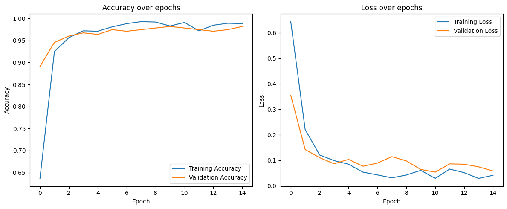
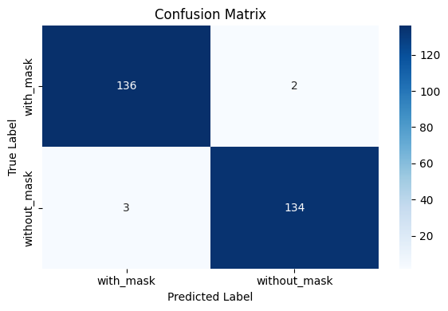

# 😷 Face Mask Detection with CNN

🎯 A lightweight and efficient Convolutional Neural Network (CNN) model for binary image classification — detecting whether a person is wearing a face mask or not.

---

## 📁 Dataset  
The dataset contains two classes:  
- with_mask  
- without_mask  

It was sourced from a publicly available dataset on GitHub:  
[observations/experiements/data](https://github.com/prajnasb/observations)

---

## 🏗 Model Architecture  
A custom-built Convolutional Neural Network (CNN) was designed from scratch (without transfer learning), consisting of:  
- 3 convolutional layers with ReLU activation  
- MaxPooling after each convolutional layer  
- Flatten layer followed by fully connected Dense layers  
- Dropout for regularization  
- Sigmoid activation for binary classification  

---

## ⚙️ Training  
- Image size: 100 × 100  
- Batch size: 32  
- Optimizer: Adam (learning rate = 0.001)  
- Loss function: Binary Crossentropy  
- Epochs: 15  
- Data augmentation: rotation, zoom, horizontal flip  
- 80% training / 20% validation split  

---

## 📈 Results  
- Final validation accuracy: 98%  
- High precision, recall, and F1-score for both classes  
- Evaluation visuals (accuracy, loss, confusion matrix) available in images/ folder

---

## 📊 Evaluation Visuals

  
   
  

---

## 💻 How to Run  
Run the main notebook:  
📄 Face_Mask_Detection_CNN.ipynb

---

## ⚖️ License
This project is licensed under the MIT License — see the [LICENSE](../LICENSE) file for details.

---

## 👩‍💻 Author  
Developed by Forough Ghayyem  
📫 [GitHub](https://github.com/foroughm423) | [LinkedIn](https://www.linkedin.com/in/forough-ghayyem/)
